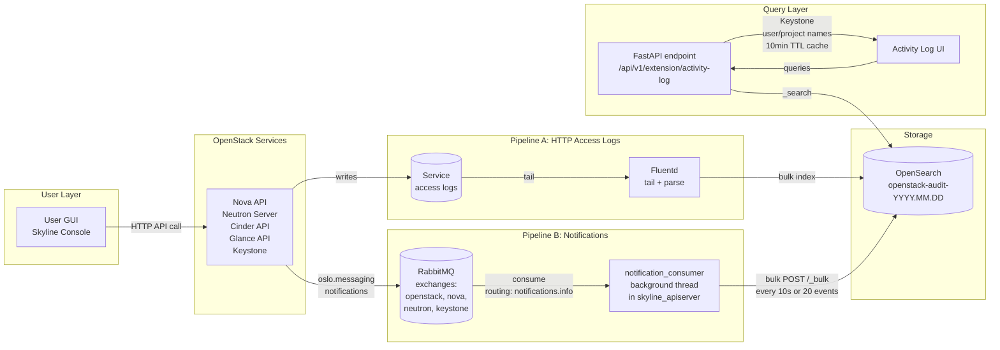
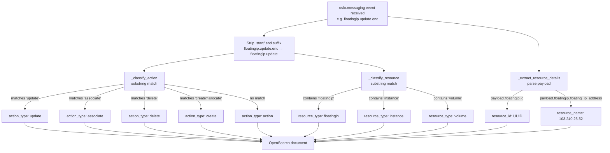
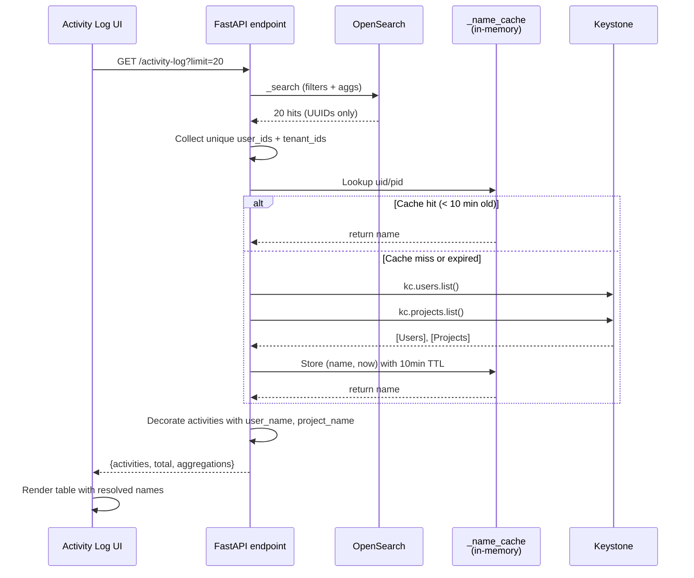

# Activity Log — Full Architecture

## Overview

Activity Log is a centralized audit trail that captures every action performed against OpenStack services and presents them in a unified, filterable UI. It aggregates data from **two parallel pipelines** (HTTP access logs + oslo.messaging notifications) into a single OpenSearch index, then serves it to the Skyline console via a FastAPI endpoint.

---

## 1. End-to-End Data Flow



---

## 2. Source Pipelines

### Pipeline A — HTTP Access Logs (Fluentd)

**What it captures:** Every HTTP request reaching any OpenStack API.

| Source File | Service | Log Format |
|---|---|---|
| `/var/log/kolla/nova/nova-api-access.log` | nova | Apache combined + response time |
| `/var/log/kolla/neutron/neutron-server.log` | neutron | WSGI + request_id |
| `/var/log/kolla/cinder/cinder-api-access.log` | cinder | Apache combined |
| `/var/log/kolla/glance/glance-api.log` | glance | Eventlet raw (parsed via regex) |
| `/var/log/kolla/keystone/keystone-apache-*.log` | keystone | Apache combined |
| `/var/log/kolla/horizon/horizon-access.log` | horizon | Apache combined |
| `/var/log/kolla/skyline/skyline-nginx-access.log` | skyline | Nginx custom |

**Fluentd pipeline stages:**
1. **Input** (`source`): `in_tail` on `/var/log/kolla/*/*-access.log` with tag `kolla.*`
2. **Rewrite tag** (`rewrite_tag_filter`): routes by `programname` to parsers (`apache_access`, `wsgi_access`, `openstack_python`)
3. **Parse** (`record_transformer` + `parser`): grok patterns extract `http_method`, `http_url`, `http_status`, `http_response_time_us`, `client_ip`, `user_id`, `tenant_id`
4. **Output** (`match`): bulk writes to OpenSearch at `https://lab-int.xloud.tech:9200` with `logstash_prefix=openstack-audit` (daily index: `openstack-audit-2026.04.05`)

### Pipeline B — oslo.messaging Notifications (notification_consumer.py)

**What it captures:** Structured "business events" (instance.create.end, floatingip.update.end, etc.) that OpenStack services publish to RabbitMQ.

**Location:** [`skyline_apiserver/api/v1/notification_consumer.py`](../../xloud-skyline-apiserver/skyline_apiserver/api/v1/notification_consumer.py)

**Pipeline:**
1. **Startup**: Spawned as daemon thread by `main.py` at apiserver boot (`on_startup`)
2. **Connect**: `pika.BlockingConnection` to RabbitMQ at `10.0.1.71:5672` (HA: 3 nodes) with credentials `openstack:***`
3. **Bind**: Creates queue `skyline_audit` bound to 4 exchanges with routing key `notifications.info`:
   - `openstack` (common)
   - `nova`
   - `neutron`
   - `keystone`
4. **Parse**: `_parse_oslo_message()` unwraps `oslo.message` JSON envelope
5. **Classify**: `_classify_action()` + `_classify_resource()` (see section 4)
6. **Extract**: `_extract_resource_details()` pulls `resource_id` + `resource_name` from payload
7. **Buffer**: Holds up to 20 events (`BULK_SIZE`) or flushes every 10 sec (`FLUSH_INTERVAL`)
8. **Write**: HTTP POST to `http://10.0.1.71:9200/_bulk` using NDJSON format

**Why both pipelines?**
- **HTTP logs** capture every API call, even failed ones (401, 403, 500) and read operations (GET).
- **Notifications** have richer payloads (resource names, proper action types) but only cover mutation events.
- Fallback: when notification is missing, HTTP log fills in; when HTTP is missing, notification provides it.

---

## 3. OpenSearch Document Schema

Index pattern: **`openstack-audit-YYYY.MM.DD`** (daily rollover)

### Core fields (present in both pipelines)
| Field | Type | Source | Example |
|---|---|---|---|
| `@timestamp` | date | auto | `2026-04-05T10:41:39.239588Z` |
| `service` | keyword | pipeline tag | `neutron`, `nova`, `keystone` |
| `tenant_id` | keyword | payload/request | `aa40fea9621b4870991f3f33c5782bc5` |
| `user_id` | keyword | payload/request | `88417b68c9b945f8931586e4df9c8330` |
| `node` | keyword | hostname | `xd1`, `xd2`, `xd5` |

### Notification-only fields
| Field | Type | Source | Example |
|---|---|---|---|
| `event_type` | keyword | oslo.messaging | `floatingip.update.end` |
| `action_type` | keyword | classifier | `create`, `associate`, `update` |
| `resource_type` | keyword | classifier | `floatingip`, `instance`, `volume` |
| `resource_id` | keyword | payload | UUID |
| `resource_name` | keyword | payload | `103.240.25.52` (for FIP) |
| `priority` | keyword | oslo envelope | `INFO` |
| `message_id` | keyword | oslo envelope | `7e3307e3-b396-4fa7-a427-8f02302746ea` |
| `event_category` | keyword | consumer | `notification` |

### HTTP-log-only fields
| Field | Type | Source | Example |
|---|---|---|---|
| `http_method` | keyword | Apache log | `POST`, `DELETE` |
| `http_url` | keyword | Apache log | `/v2.1/servers/abc123/action` |
| `http_status` | keyword | Apache log | `200`, `404` |
| `http_response_time_us` | long | Apache log | `12345` (microseconds) |
| `client_ip` | keyword | Apache log | `103.240.25.200` |
| `request_id` | keyword | OpenStack header | `req-abc123-def456` |
| `Payload` | text | raw log line | full access.log row |
| `Hostname` | keyword | Fluentd host | `xd1.xloud.local` |
| `log_level` | keyword | log marker | `INFO`, `WARNING`, `ERROR` |

---

## 4. Action & Resource Classification



When notification_consumer receives `event_type = "floatingip.update.end"`, it classifies:

### `_classify_action(event_type)` — ordered substring matching after stripping `.start`/`.end`

| Pattern match | → action_type | Example event_type |
|---|---|---|
| `delete`, `destroy` | `delete` | `instance.delete.start` |
| `allocate` | `create` | `floatingip.allocate.start` |
| `disassociate` | `disassociate` | `floatingip.disassociate.end` |
| `associate` | `associate` | `floatingip.associate.end` |
| `create`, `import` | `create` | `volume.create.end` |
| `update`, `resize`, `extend` | `update` | `floatingip.update.end` |
| `power_off`, `shutdown` | `stop` | `instance.power_off.end` |
| `reboot` | `reboot` | `instance.reboot.start` |
| `unpause`/`pause` | `unpause`/`pause` | `instance.pause.end` |
| `shelve`/`unshelve` | `shelve`/`unshelve` | `instance.shelve.end` |
| `resume`/`suspend` | `resume`/`suspend` | |
| `power_on`, `start`, `stop` | `start`/`stop` | |
| `migrate`, `evacuat` | `migrate` | `instance.migrate.end` |
| `attach`/`detach` | `attach`/`detach` | `compute.instance.volume.attach` |
| `snapshot` | `snapshot` | `instance.snapshot.end` |
| `lock`/`unlock` | `lock`/`unlock` | |
| `authenticate` | `authenticate` | |
| `rescue` | `rescue` | |
| (fallback) | `action` | any unmatched |

### `_classify_resource(event_type)` — substring matching

| Pattern | → resource_type |
|---|---|
| `instance`, `compute`, `server` | `instance` |
| `volume` | `volume` |
| `snapshot` | `snapshot` |
| `network` | `network` |
| `subnet` | `subnet` |
| `port` | `port` |
| `router` | `router` |
| `floatingip` | `floatingip` |
| `security_group` | `security_group` |
| `keypair` | `keypair` |
| `image` | `image` |
| `user`/`project`/`role`/`domain` | `user`/`project`/`role`/`domain` |

### `_extract_resource_details(event_type, payload)` — payload parsing

Different services put resource IDs in different payload fields:

| Payload field | Resource | Name source |
|---|---|---|
| `payload.instance_id` | Instance | `display_name` or `hostname` |
| `payload.volume_id` | Volume | `display_name` |
| `payload.network.id` | Network | `network.name` |
| `payload.port.id` | Port | `port.name` |
| `payload.router.id` | Router | `router.name` |
| `payload.subnet.id` | Subnet | `subnet.name` |
| `payload.floatingip.id` | Floating IP | `floatingip.floating_ip_address` |
| `payload.security_group.id` | Security Group | `security_group.name` |

---

## 5. Skyline API Endpoint

**Location:** [`skyline_apiserver/api/v1/activity_log.py`](../../xloud-skyline-apiserver/skyline_apiserver/api/v1/activity_log.py)

### `GET /api/v1/extension/activity-log`

#### Request parameters
| Param | Type | Description |
|---|---|---|
| `service` | string | Filter by service (expanded via `SERVICE_EXPAND`) |
| `action_type` | string | `create`, `delete`, `update`, `associate`, etc. |
| `resource_type` | string | `Instance`, `Floating IP`, etc. |
| `user_id` | uuid | Filter by user |
| `project_id` | uuid | Filter by project (admin only) |
| `http_status` | int | 200, 404, 500, etc. |
| `start`/`end` | ISO date | Time range |
| `search` | string | Full-text on `http_url`, `Payload`, `resource_id` |
| `limit`/`offset` | int | Pagination |

#### Service alias expansion
When user filters by `service=nova`, the backend queries for ALL of:
```
["nova", "compute", "api", "scheduler", "conductor", "compute_task", "servergroup"]
```
Because Nova uses different service tags in different log sources.

| User-facing | Expanded to |
|---|---|
| `nova` | nova, compute, api, scheduler, conductor, compute_task, servergroup |
| `neutron` | neutron, network |
| `cinder` | cinder, volume, snapshot |

#### Default noise exclusion (when no service filter set)
```python
_DEFAULT_EXCLUDE = {
  "must_not": [
    {"term": {"service.keyword": "keystone"}},           # ~35k/day token chatter
    {"bool": {"must": [                                  # Horizon login 404s
      {"term": {"service.keyword": "horizon"}},
      {"terms": {"resource_type.keyword": ["login", "unknown"]}}
    ]}},
    {"wildcard": {"event_type.keyword": "scheduler.*"}}, # Internal placement
    {"term": {"service.keyword": "conductor"}},          # Nova conductor RPC
    {"bool": {"must": [                                  # Service-account probes
      {"terms": {"http_url.keyword": ["/v2.1/servers/fake-instance-id"]}}
    ]}},
    {"wildcard": {"event_type.keyword": "binding.*"}}    # Neutron port binding
  ]
}
```

#### RBAC: Non-admin users see only their project
```python
if not is_admin:
    filters.append({"term": {"tenant_id": profile.project_id}})
```

#### Aggregations (for filter dropdowns)
Returns `by_service`, `by_action_type`, `by_resource_type`, `by_status` with top values and doc counts.

---

## 6. User/Project Name Resolution



Raw OpenSearch docs only have UUIDs. Names are resolved at query time with **10-minute TTL in-memory cache**.

**Flow:**
1. Collect unique `user_id` and `tenant_id` values from query results
2. Check cache (`_name_cache[f"u:{uid}"]` → `(name, timestamp)`)
3. For uncached IDs, fetch from Keystone using admin system session:
   ```python
   kc = ks_client.Client(session=get_system_session())
   users = kc.users.list()
   projects = kc.projects.list()
   ```
4. Store in cache + return `user_map`, `project_map`
5. Decorate activities with `user_name`, `project_name` fields

**Why cache?** Keystone `users.list()` / `projects.list()` are expensive. Cache avoids per-query calls.

---

## 7. URL-based Resource Extraction

For HTTP log entries without structured notification data, the backend parses URLs:

**Resource type map** (partial — full list in `_RESOURCE_TYPE_MAP`):
| URL segment | → resource_type |
|---|---|
| `servers` | Instance |
| `floatingips` | Floating IP |
| `volumes` | Volume |
| `images` | Image |
| `networks` | Network |
| `ports` | Port |
| `security-groups` | Security Group |
| `os-keypairs` | Key Pair |
| `os-server-groups` | Server Group |
| `loadbalancers` | Load Balancer |
| `stacks` | Stack |

**Extraction algorithm** (`_extract_resource_label`):
1. Clean URL (strip query string, trailing `HTTP/1.1`)
2. Split by `/`, walk backwards
3. Skip UUIDs, version segments (`v2.1`, `v2.0`), and `action`/`detail`/`accept`
4. First known resource segment wins

**Example:**
```
URL: "/v2.0/floatingips/727d88cc-12fd-4e36-a028-23ba00bc10d0 HTTP/1.1"
→ clean: "/v2.0/floatingips/727d88cc-..."
→ walk back: skip UUID → "floatingips" → "Floating IP"
resource_id extracted via _RE_UUID regex: "727d88cc-12fd-4e36-a028-23ba00bc10d0"
```

---

## 8. Mapping User Actions → Log Entries

Here's how specific GUI actions end up in the Activity Log:

| GUI Action | HTTP API call | Notification event | Final action_type/resource |
|---|---|---|---|
| Create instance | `POST /v2.1/servers` | `instance.create.end` | `create` / `Instance` |
| Delete instance | `DELETE /v2.1/servers/{id}` | `instance.delete.end` | `delete` / `Instance` |
| Stop instance | `POST /v2.1/servers/{id}/action` (os-stop) | `instance.power_off.end` | `stop` / `Instance` |
| Start instance | `POST /v2.1/servers/{id}/action` (os-start) | `instance.power_on.end` | `start` / `Instance` |
| Reboot | `POST .../action` (reboot) | `instance.reboot.end` | `reboot` / `Instance` |
| Resize | `POST .../action` (resize) | `instance.resize.end` | `update` / `Instance` |
| Associate floating IP | `PUT /v2.0/floatingips/{id}` | `floatingip.update.end` | `update` / `Floating IP` |
| Allocate floating IP | `POST /v2.0/floatingips` | `floatingip.create.end` | `create` / `Floating IP` |
| Create network | `POST /v2.0/networks` | `network.create.end` | `create` / `Network` |
| Create volume | `POST /v3/.../volumes` | `volume.create.end` | `create` / `Volume` |
| Attach volume | `POST .../os-volume_attachments` | `compute.volume.attach.end` | `attach` / `Volume` |
| Upload image | `POST /v2/images` | `image.upload` | `create` / `Image` |
| Create keypair | `POST /v2.1/os-keypairs` | `keypair.create.end` | `create` / `Key Pair` |
| Create user | `POST /v3/users` | `identity.user.created` | `create` / `User` |

**Two-record rule:** Most mutations produce TWO rows in Activity Log:
1. HTTP access log row (has `http_url`, `http_status`, `client_ip`, `request_id`)
2. Notification row (has `event_type`, `resource_name`, `message_id`)

The frontend deduplicates visually by showing rich notification data first, with HTTP context in `http_url`/`http_status` columns.

---

## 9. Response Schema (what the frontend gets)

```json
{
  "activities": [
    {
      "timestamp": "2026-04-05T10:41:39.239588Z",
      "service": "neutron",
      "action_type": "update",
      "resource_type": "Floating IP",
      "resource_id": "727d88cc-12fd-4e36-a028-23ba00bc10d0",
      "resource_name": "103.240.25.75",
      "event_type": "floatingip.update.end",
      "http_method": "PUT",
      "http_url": "/v2.0/floatingips/727d88cc-...",
      "http_status": "200",
      "response_time": 0.0542,
      "user_id": "88417b68c9b945f8931586e4df9c8330",
      "user_name": "rachit",
      "project_id": "aa40fea9621b4870991f3f33c5782bc5",
      "project_name": "admin",
      "request_id": "req-abc-...",
      "client_ip": "103.240.25.200",
      "node": "xd1",
      "log_level": "INFO"
    }
  ],
  "total": 1106,
  "aggregations": {
    "by_service": [{"key": "nova", "count": 335}, ...],
    "by_action_type": [{"key": "create", "count": 210}, ...],
    "by_resource_type": [{"key": "Instance", "count": 80}, ...],
    "by_status": [{"key": "200", "count": 900}, ...]
  }
}
```

---

## 10. Frontend Integration

**Location:** [`src/pages/management/containers/ActivityLog/index.jsx`](../src/pages/management/containers/ActivityLog/index.jsx)
**Store:** [`src/stores/nova/activity-log.js`](../src/stores/nova/activity-log.js)
**Route:** `/monitor-center/activity-log-admin` (admin menu)

**Features:**
- Color-coded service tags (nova=blue, neutron=green, cinder=orange, etc.)
- Action type pills (create=green, delete=red, update=blue)
- HTTP status badges (2xx green, 4xx orange, 5xx red)
- Filters: service, action_type, resource_type, time range, full-text search
- Pagination (20/50/100/200 per page)
- Sorting by timestamp (desc default)

---

## 11. Environment & Configuration

### OpenSearch connection
```bash
OPENSEARCH_URL=http://10.0.1.71:9200  # Env var, default
OPENSEARCH_INDEX=openstack-audit-*    # Hardcoded
OPENSEARCH_TIMEOUT=10.0
```

### RabbitMQ (notification_consumer)
```bash
RABBIT_HOST=10.0.1.71
RABBIT_PORT=5672
RABBIT_USER=openstack
RABBIT_PASS=*** (from env or default)
RABBIT_VHOST=/
QUEUE_NAME=skyline_audit
EXCHANGES=["openstack", "nova", "neutron", "keystone"]
ROUTING_KEY=notifications.info
BULK_SIZE=20
FLUSH_INTERVAL=10  # seconds
```

### Fluentd cluster config
- Host: `lab-int.xloud.tech:9200`, scheme HTTPS (TLSv1.2)
- Index prefix: `openstack-audit`
- Logstash format: `true` (daily indices)
- Bulk threshold: tunable
- Buffer: file-based, 15s flush

---

## 12. Troubleshooting

| Symptom | Cause | Fix |
|---|---|---|
| No logs for recent action | Notification consumer thread died | Check `docker logs skyline_apiserver \| grep notification_consumer` |
| Logs in OpenSearch but not in UI | Noise filter masks them | Check `_DEFAULT_EXCLUDE`, or filter by service |
| User name shows as UUID | Keystone unreachable | Check `/api/v1/extension/activity-log` backend logs |
| Only admin actions show | Non-admin user, tenant_id filter | Expected — non-admins see only their project |
| Wrong service (e.g. "api" instead of "nova") | Notification tag inconsistency | `SERVICE_ALIASES` map handles this |
| Duplicate entries (HTTP + notification) | Both pipelines fire | Expected — richer data wins |
| action_type = "action" for FIP associate | Classifier missed pattern | Fixed in `notification_consumer.py` with associate/disassociate |

---

## 13. Where to Change What

| Change | File |
|---|---|
| Add new resource URL mapping | `activity_log.py` → `_RESOURCE_TYPE_MAP` |
| Add new action classification | `notification_consumer.py` → `_classify_action()` |
| Filter out new noise | `activity_log.py` → `_DEFAULT_EXCLUDE` |
| Add new service alias | `activity_log.py` → `SERVICE_ALIASES` / `SERVICE_EXPAND` |
| Change cache TTL | `activity_log.py` → `_cache_ttl` |
| Add notification exchange | `notification_consumer.py` → `EXCHANGES` list |
| Display new field in UI | `src/pages/management/containers/ActivityLog/index.jsx` column def |
| Change OpenSearch endpoint | Env `OPENSEARCH_URL` on skyline_apiserver |
| Tail new access log | Fluentd `/etc/xavs/fluentd/fluentd.conf` → add `<source>` |

---

## 14. Known Limitations

1. **No retention policy** — daily indices grow forever. Add ISM policy in OpenSearch to close/delete old indices.
2. **Name cache is per-process** — restart drops it. For HA, switch to Redis.
3. **No correlation ID across pipelines** — HTTP log's `request_id` and notification's `message_id` are different.
4. **Glance eventlet logs parsed via regex** — brittle. Any log format change breaks parsing.
5. **Non-admin scoping relies on tenant_id** — if a service omits tenant_id in notifications, the user can't see it.
